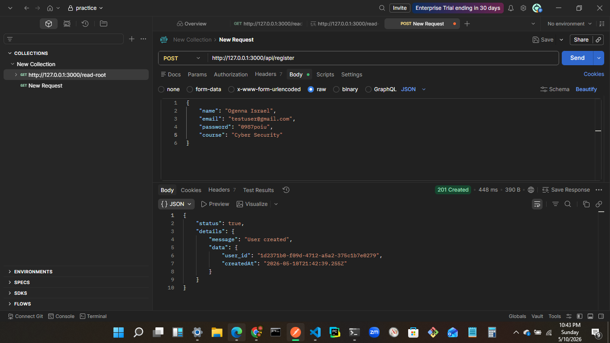

## Project Name
Student Registration System - A backend service for managing student accounts and course enrollments.

## Overview
This project is a web-based backend system designed to help educational institutions manage student registrations. It allows new students to create accounts by providing their email, password, and course information. The system stores this information securely in a database and provides basic user management capabilities.

The application is built for administrators and students who need a simple way to handle account creation in an educational setting. It solves the problem of manual student registration processes by providing an automated, secure way to collect and store student data with proper validation and duplicate prevention.

While currently focused on registration, the system is structured to support future features like login, email verification, and user profile management.

## Tech Stack
- **Node.js**: The runtime environment that executes the JavaScript code server-side.
- **Express.js**: A web framework for building the API endpoints and handling HTTP requests.
- **SQLite3**: A lightweight database that stores all user data without needing a separate database server.
- **Sequelize**: An ORM (Object-Relational Mapping) tool that simplifies database operations and model definitions.
- **bcryptjs**: A library for securely hashing passwords before storing them.
- **AJV**: A JSON schema validator that ensures incoming data meets required formats and rules.
- **dotenv**: A tool for managing environment variables like server port and security settings.
- **Nodemon**: A development utility that automatically restarts the server when code changes.

## System Architecture
The project uses a layered architecture pattern where different folders handle specific responsibilities. The main entry point is `app.js`, which sets up the Express server and connects all the pieces together.

The `config` folder contains setup files for the database connection and validation rules. Controllers in the `controllers` folder process incoming requests and send responses. Models in the `models` folder define the database structure. Routes in the `routes` folder map URLs to controller functions. Schemas in the `schemas` folder define the data validation rules. Services in the `services` folder contain the business logic like password hashing. The `storage` folder holds the actual database file.

This separation makes the code easier to maintain and test, with each layer having a clear purpose.

## Core Features
The system currently supports one main feature: student registration.

**Student Registration**: New students can create accounts by submitting their email, password, name, and course. The system validates the input data, checks for duplicate emails, hashes the password securely, and saves the information to the database. It returns a success message with the new user's ID and creation timestamp. This feature applies to students who need to enroll in courses and administrators who manage the registration process.

The system also includes a basic health check endpoint to verify the server is running.

## API Overview
The API currently has two endpoints, both related to user management:

**Registration Group**:
- `POST /api/register`: Creates a new student account with email, password, name, and course information. Returns user details on success or error messages for validation failures or duplicates.

**Health Check Group**:
- `GET /read-root`: Simple endpoint that confirms the server is operational.

All endpoints return JSON responses with a status flag and details about the operation result.

## Authentication & Security
The system uses bcryptjs to hash passwords before storing them in the database, making it difficult for attackers to recover plain text passwords even if they access the database. The number of hashing rounds can be configured through environment variables.

Input validation is handled through AJV schemas that check email formats, minimum password lengths, and required fields. This prevents malformed data from being processed.

The database enforces unique email constraints to prevent duplicate accounts. User IDs are generated as UUIDs for better security and distributed system compatibility.

Currently, there is no login authentication or session management implemented - the system only handles registration.

## Payment Flow
This feature is not implemented in the current system. The project is focused on user registration and does not include any payment processing capabilities.

## Database Design
The system uses a single SQLite database table called "Users" with the following fields:

- `user_id`: A unique identifier (UUID) that serves as the primary key
- `email`: The student's email address (must be unique)
- `password`: The hashed password string
- `name`: The student's name (optional)
- `course`: The course the student is enrolled in
- `isActive`: A flag indicating if the account is active (defaults to false)
- `isVerified`: A flag for email verification status (defaults to false)
- `createdAt` and `updatedAt`: Automatic timestamps for record creation and updates

The database automatically creates and updates the schema when the server starts. Email and user_id fields are indexed for faster lookups.

## Getting Started
To run this project locally, you'll need Node.js and npm installed on your computer.

First, navigate to the backend folder in your terminal. Run `npm install` to download all the required dependencies.

Create a `.env` file in the backend folder with these settings (or use the defaults):
```
PORT=3000
HOSTNAME=127.0.0.1
SALT_ROUNDS=10
```

To start the development server with automatic restarts on code changes, run `npm run dev`. For production, use `node app.js`.

The server will start on http://127.0.0.1:3000 and create the database file automatically on first run. You can test the registration endpoint using tools like Postman or curl.